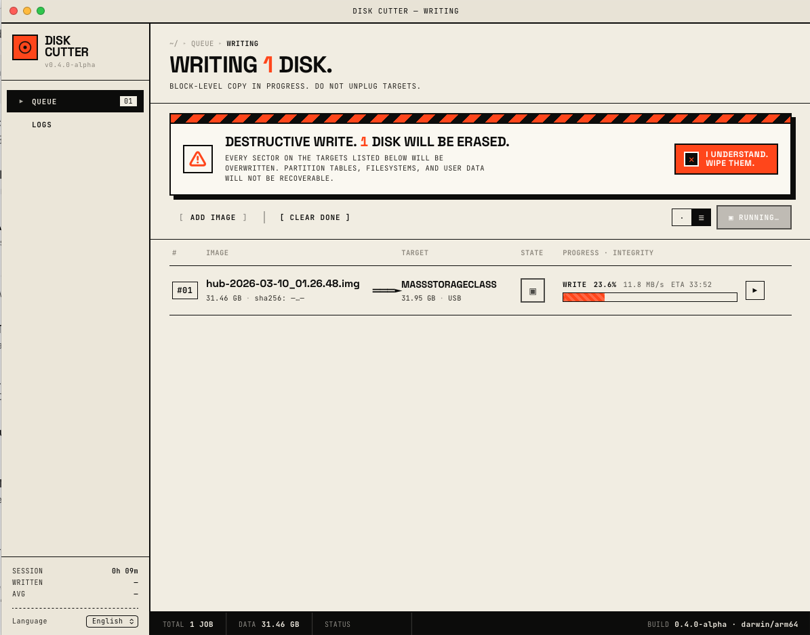

# Disk Cutter

A desktop disk-image writer: pick an ISO/IMG/QCOW2/VHD/VHDX/VMDK or a
gzip/xz/bzip2/zstd-compressed image, pick a USB stick or SD card, get a
sector-verified flash with live progress, parallel queueing, and a
persistent history. Tauri 2 shell, React 18 UI, Rust burn pipeline.
Effectively a Rust rewrite of the Balena Etcher core idea, with a real
parallel job queue, an SQLite-backed history, swappable writer
pipelines, content-validation guards, and a curated distro catalog.




## Status

Alpha (0.5.0-alpha). macOS is the primary
target — raw-device I/O, DiskArbitration unmount, and `osascript`
privilege elevation all work end-to-end there. Linux and Windows
builds compile and run; disk enumeration is implemented (sysfs on
Linux, `Win32_DiskDrive` on Windows) but elevation paths are
macOS-only for now.

## Features

### Image sources
- Raw ISO/IMG/BIN
- Compressed: gzip, xz, bzip2, zstd
- Virtual disk containers: QCOW2, VHD, VHDX, VMDK (sparse clusters
  expand to zeros transparently)
- Content-based magic-byte detection — a renamed `ubuntu.iso.gz`
  still routes to the gzip factory instead of burning corrupt bytes
- Pre-burn content validation: rejects archives masquerading as
  bootable images (e.g. `.tar.gz` of photos that pass the gzip magic
  check) via partition-table probe + whole-device filesystem sniff
- Source-image inspector: partition table + filesystem probe before
  you commit to a write
- Drag-and-drop onto the window
- URL fetch: paste an image link, it downloads and queues
- Curated distro catalog: JSON-backed picker with remote refresh and
  bundled fallback (Ubuntu, Debian, Fedora, Raspberry Pi OS, …)

### Burn pipeline
- Parallel job queue: flash the same image to many targets, or
  different images to different targets, concurrently
- Three swappable `DeviceIo` writer impls — single-thread raw,
  single-thread block, or a pipelined worker pool — selected at
  runtime via the Prefs panel
- Pipelined writer keeps the USB-MSC command queue saturated; ~5×
  the throughput of a naive `write_all` loop on the same hardware
- Selectable hash algorithm: SHA-256 (default) or xxh64 (faster,
  non-cryptographic)
- Pre-burn snapshot of the target's first 4 MiB so a mis-targeted
  disk is recoverable
- SHA-256 (or xxh64) verification of every write, with byte-by-byte
  fallback recording the first N mismatches on hash divergence
- Sparse-aware hole-punching writer for image targets
- Cancellation at any phase (burn, verify) wired through the helper
- Auto-eject after a successful burn
- Tunable: chunk size, worker threads, queue depth, max mismatches,
  skip-verify, writer impl, hash algorithm — all live in the Prefs
  view

### Backup, validation, forensics
- Disk → image backup pipeline: reverse of burn, with optional
  gzip/xz/bzip2/zstd compression
- QCOW2 sparse-aware fast path via `allocated_extents` — only
  reads/writes used clusters
- Tamper-evident forensic burn-record export (JSON + Markdown) for
  audit trails
- QEMU bootability test: post-burn smoke test that the image
  actually boots in a local QEMU snapshot

### History & diagnostics
- SQLite-backed persistent burn history (`burn_jobs`, `burn_mismatches`,
  `burn_logs`, plus a `config` key/value table for runtime tunables)
- Logs view in the sidebar with per-row mismatch and log detail
- Doctor panel: self-diagnostic environment checklist (also exposed
  as `diskcutter doctor` on the CLI)
- SMART preflight check on the target drive

### Platform integration
- macOS-native privilege escalation via `osascript` (no persistent
  root daemon)
- DiskArbitration session we own, sidestepping the
  `diskutil unmountDisk` remount race
- `F_NOCACHE` on raw-device writes so the unified buffer cache is
  bypassed regardless of writer impl
- Orphan-helper detection with one-click cleanup
- Full Disk Access settings shortcut from inside the app

### UX
- Light / dark theme toggle (`:root[data-theme="dark"]`)
- i18n: English, German, Spanish — kept in key-parity by a
  pre-commit check
- Drag-and-drop overlay with brutalist "DROP DISK IMAGE HERE" prompt
- Keyboard shortcuts: Cmd/Ctrl+O add image, Return start queue,
  Cmd/Ctrl+, prefs, Cmd/Ctrl+L logs
- Transient toast notifications for app-level errors
- Disk picker groups targets into Allowed / Too Small / Not Permitted
- Standalone CLI (`diskcutter …`) for scripted use

## Install (macOS)

1. Download the latest `.dmg` from the Releases page (or build one
   yourself — see [Development](#development)).
2. Drag **Disk Cutter.app** to **/Applications**.
3. Launch it once. The first time you start a burn, macOS will block
   `/dev/rdiskN` access. Open **System Settings → Privacy & Security →
   Full Disk Access**, flip the toggle for **Disk Cutter**, and retry.
   The app surfaces an `ENEEDS_FDA` banner with a one-click shortcut
   to the right pane when this happens.

## Usage

- Add an image (drag-and-drop onto the window, pick from the toolbar,
  paste a URL, or choose from the bundled distro catalog).
- Pick a disk (the picker only shows whole, removable targets and
  groups them by permission/size eligibility).
- Hit start. Verification runs automatically — fast hash compare on
  the happy path, byte-by-byte fallback if hashes diverge.

## Development

```sh
npm install
npx tauri dev          # hot-reloads UI + Rust
npx tauri build        # bundled .app / .dmg in src-tauri/target/release/bundle
```

For Rust-only iteration (skip the JS toolchain):

```sh
cargo check --manifest-path src-tauri/Cargo.toml
cargo test  --manifest-path src-tauri/Cargo.toml
```

For scripted use, the same binary exposes a CLI surface:

```sh
diskcutter doctor              # environment checklist
diskcutter list                # enumerate disks
diskcutter burn  <disk>   # burn (requires elevation)
```

Pre-commit hook (`cargo fmt --check`, `clippy -D warnings`, and i18n
key-parity check) lives at `.githooks/pre-commit`; enable with
`git config core.hooksPath .githooks` or run
`./scripts/install-hooks.sh`.

## Architecture

The UI runs unprivileged. When a burn starts, the main binary
re-execs itself with `--helper-burn` under
`osascript "with administrator privileges"`; the elevated helper
opens the raw device, drives the write+verify pipeline, and streams
JSONL progress to a temp file that the main process tails and
re-emits as Tauri events. Unmount goes through a DiskArbitration
session we own (avoids the `diskutil unmountDisk` remount race).
Cancellation is wired through `AtomicBool` flags into both the burn
and verify loops.

The actual byte-pushing is done by one of three swappable `DeviceIo`
impls — single-thread raw, single-thread block, or a pipelined
worker pool — selected at runtime via a config key. The pipelined
impl uses a worker pool `pwrite`-ing to a shared FD at supplied
offsets through a bounded `sync_channel`, keeping the USB driver
command queue full.

Image readers are pluggable via an `ImageReaderFactory` registry.
Each factory accepts a file when either the extension or the
format's magic signature matches. Compressed readers (gzip / xz /
bzip2 / zstd) wrap a structured-container reader (qcow2 / vhd /
vhdx / vmdk) or the raw fallback; format labels carry both layers
(e.g. "ISO 9660 / XZ").

Persistence is SQLite via `rusqlite (bundled)`. Migrations live in
`db/migrations.rs` and apply idempotently at startup; failure to
open the DB downgrades to in-memory mode rather than aborting.

Full breakdown lives in [docs/architecture.md](docs/architecture.md).
Per-release notes in [CHANGELOG.md](CHANGELOG.md). Performance
tunables in [docs/PERFORMANCE.md](docs/PERFORMANCE.md).

## FAQ

**Why does it ask for my password on every burn?**
macOS requires admin rights to open `/dev/rdiskN` for writing. The
helper process is re-execed under `osascript` for each burn so the
elevated binary lives only as long as the job; there is no persistent
root daemon.

**Why does Full Disk Access keep coming up?**
TCC sits above the admin layer. Even as root, the helper can't touch
removable raw devices until the **Disk Cutter.app** bundle is granted
Full Disk Access. Toggle it once in System Settings and macOS
remembers.

**How do I switch the writer implementation for testing?**
Open **Preferences → Performance** and change the writer impl
(`raw` / `block` / `pipelined`). The setting takes effect on the next
job; nothing to restart.

**What does "verify failed: hash mismatch" mean?**
The image was written but reading it back produced a different
SHA-256 (or xxh64, if selected). Almost always a flaky SD card or a
worn USB stick — try a different target. If the same target fails
repeatedly across known-good images, retire it.

**Why was my `.iso` rejected before the burn even started?**
The content-validation gate didn't find a partition table or a
recognised filesystem inside the image. Most often this means the
file is actually a compressed archive of random files rather than a
disk image. If you're sure it's a custom embedded image, the burn
will still go ahead if there's an `0x55 0xAA` boot signature at
offset 510.

## License

MIT. See [LICENSE](LICENSE).
